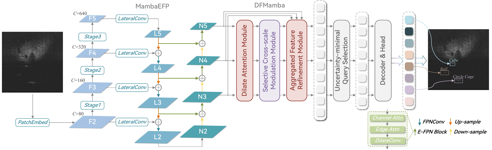

# MambaDSF

[](https://creativecommons.org/licenses/by-nc-sa/4.0/)
[]()

**Hybrid Mamba-Transformer with Multi-Scale Dilated Attention for Small Target Detection in Sonar Images**

> ⚠️ **Notice**: This paper is currently **under review** at *IEEE Geoscience and Remote Sensing Letters (GRSL)*. Please do not publish derivative works or competing papers based on this code before our paper is officially published. If you wish to use this code for academic research, please contact us first.

<p align="center">
  
</p>

## Overview

MambaDSF is a hybrid framework that leverages selective state space models (SSMs) for linear-complexity global context modeling in sonar imagery. The framework addresses three key challenges in small target detection:

- **Scarce discriminative features**: Small targets span limited pixels and may reduce to one or two feature-map cells after downsampling.
- **Low signal-to-noise ratio**: Target responses are comparable in intensity to reverberation and speckle noise.
- **Scale ambiguity**: Apparent target size varies with imaging range and resolution.

## Architecture

MambaDSF consists of three main components:

1. **MambaFPN Backbone**: Couples MambaVision with a bidirectional feature pyramid (FPN + PANet) for multi-scale extraction and long-range dependency modeling.
2. **DFMamba Encoder**: Performs intra-scale dilated attention at four receptive-field scales and cross-scale SSM fusion for semantic alignment.
3. **SA-WIoU & CSC Loss**: SA-WIoU (Size-Adaptive Wasserstein-IoU) for small target regression and CSC (Cross-Scale Semantic Consistency) loss for multi-scale feature alignment.

### Qualitative Comparison

<p align="center">
  
</p>

*Qualitative comparison on representative UATD test samples across eight detection methods.*

## Installation

```bash
# Clone the repository
git clone https://github.com/IDontKnowAAA/MambaDSF.git
cd MambaDSF

# Install dependencies
pip install -r requirements.txt

# Install mamba-ssm (requires CUDA)
pip install mamba-ssm==1.2.0
```

Update the paths in `configs/dataset/uatd_detection.yml`.

## Acknowledgements

This work was supported in part by the National Natural Science Foundation of China under Grant 62001443, and in part by the Natural Science Foundation of Shandong Province under Grant ZR2020QE294.

## Contact

- Hui Lin: harrylin929@gmail.com
- Jiayi Li: leanolee58@gmail.com
- Shenghui Rong (Corresponding): rsh@ouc.edu.cn

## License

This project is licensed under the [CC BY-NC-SA 4.0](https://creativecommons.org/licenses/by-nc-sa/4.0/) License.

- **Academic use only**: Commercial use is prohibited without explicit permission.
- **Attribution required**: Please cite our paper if you use this code.
- **ShareAlike**: Modifications must be distributed under the same license.
