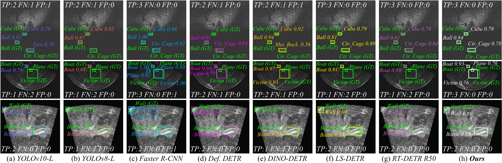

# MambaDSF

[](https://arxiv.org/licenses/nonexclusive-distrib/1.0/license.html)
[](https://arxiv.org/)

## Multi-Scale State-Space Model with Dilated Feature Fusion for Sonar Small Target Detection

> **Notice**: This manuscript is publicly available as an arXiv preprint and has been submitted to *IEEE Geoscience and Remote Sensing Letters (GRSL)*.

<p align="center">
  
</p>

## Overview

MambaDSF is a sonar small-target detection framework that integrates selective state-space modeling with dilated feature fusion. It is designed for forward-looking sonar imagery, where target echoes are often compact, low-contrast, and easily confused with reverberation or background structures.

The framework addresses three practical challenges:

- **Scarce target pixels**: Small sonar targets occupy limited image regions and may collapse to very few feature-map cells after downsampling.
- **Background ambiguity**: Reverberation, speckle-like noise, and object-shaped clutter can produce echo patterns that resemble true targets.
- **Multi-scale appearance variation**: The apparent target size and echo envelope vary with imaging range, viewpoint, and dataset domain.

## Architecture

MambaDSF consists of three main components synchronized with the current manuscript:

1. **MambaEFP Backbone**: Enhances MambaVision with efficient feature-pyramid propagation for global acoustic context modeling and multi-scale feature extraction.
2. **DFMamba Encoder**: Combines dilated local attention with Fusion State-Space Modeling (FusSSM) to align local target details and cross-scale semantic information.
3. **SA-WIoU & CSC Losses**: Introduces Scale-Adaptive Weighted IoU (SA-WIoU) for small-target localization and Cross-Scale Semantic Consistency (CSC) for feature alignment across detection scales.

### Qualitative Comparison

<p align="center">
  
</p>

*Qualitative comparison on representative UATD, FLS and MD-FLS test samples across eight detection methods.*

## Installation

```bash
# Clone the repository
git clone https://github.com/IDontKnowAAA/MambaDSF.git
cd MambaDSF

# Install dependencies
pip install -r requirements.txt

# Install mamba-ssm (requires CUDA)
pip install mamba-ssm==1.2.0
```

Update the paths in `configs/dataset/uatd_detection.yml`.

## Acknowledgements

This work was supported in part by the National Natural Science Foundation of China under Grant 62001443, and in part by the Natural Science Foundation of Shandong Province under Grant ZR2020QE294.

## Contact

- Hui Lin: [harrylin929@gmail.com](mailto:harrylin929@gmail.com)
- Jiayi Li: [leanolee58@gmail.com](mailto:leanolee58@gmail.com) ([GitHub](https://github.com/leanoLEE58))
- Jing Wang: [wangjingname@gmail.com](mailto:wangjingname@gmail.com)
- Shenghui Rong (Corresponding): [rsh@ouc.edu.cn](mailto:rsh@ouc.edu.cn)

## License

The arXiv preprint is distributed under the [arXiv.org perpetual, non-exclusive license](https://arxiv.org/licenses/nonexclusive-distrib/1.0/license.html).

Please cite the arXiv preprint if you use this work.
